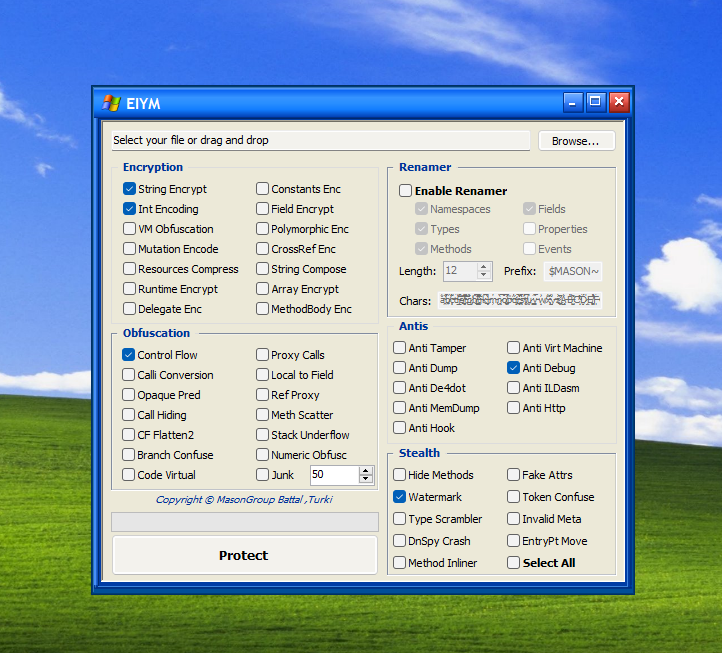

# EIYM Protector v3

**.NET Assembly Protector & Obfuscator**

Developed by **MasonGroup** (Freemasonry)
**Team:** Battal Alqhtani & Turki Alotibi



---

## About

EIYM Protector is an advanced .NET assembly protector built on top of **dnlib**.
v3 applies **48+ independent protection layers** to .NET executables and libraries
on top of a fully reworked Renamer and Junk-Code engine, making static analysis,
dynamic analysis, dumping, tampering, and reverse engineering extremely difficult.

Select your `.exe` or `.dll`, choose the protections you want, and click **Protect**.
You can also **drag and drop** a file directly onto the application.

For the full technical reference (every flag, file map, what each layer does, and
the order they run in), open **[`docs/MasonBook.pdf`](docs/MasonBook.pdf)**.

---

## What's New in v3

v3 is the polish release that fixes long-standing weaknesses in the renamer and
the junk-code engine, and that finally rewrites every decoy that previous versions
left untouched.

| Area | v2 behaviour | v3 behaviour |
|---|---|---|
| **Renamer — namespaces** | All types in one old namespace shared one new namespace | **Each top-level class lands in its own unique randomized namespace** — no two classes share one |
| **Renamer — char set** | Sometimes leaked Cyrillic homoglyphs even when user picked Latin (`$MASON~еаouаcуіcһхһxx…`) | Names are produced **strictly from the user's `Chars` setting**. `forceLatin` honoured end-to-end |
| **Renamer — decoy types** | Hardcoded decoy names (`AntiDumpAttribute`, `MemoryProtectionAttribute`, `SuppressIldasmAttribute`, `ConfusedByAttribute`, …) survived the rename | New **late injected pass** runs after every decoy injector and overwrites their type names, member names, and namespaces |
| **Renamer — `System.*` namespaces** | `System.Runtime.CompilerServices`, `System.Security`, `System.Diagnostics.Guard` etc. were preserved and visible in the output | All injected `System.*` namespaces are now overwritten too |
| **Junk Code — structure** | Flat orphan classes, no namespace, no nesting | **Multi-segment fake namespaces** (e.g. `aB.cD.eF`) shared across decoys to fake "subsystems"; **1–4 nested classes** per junk top-level, some doubly nested |
| **Junk Code — registration** | Only top-levels tracked | Every nested type registered into `injectedTypes` so the renamer's late pass picks them up too |
| **AntiILDasm marker** | `SuppressIldasmAttribute` was forced to stay in `System.Runtime.CompilerServices` to remain a marker | Marker removed; the four other AntiILDasm layers (confusing types, deep nests, malformed attrs, trap methods) still operate, and dropping the marker improves stealth (it no longer flags the binary as deliberately obfuscated) |

Everything from v2 is still here — v3 is **strictly additive on protection
strength** and **subtractive on giveaways**.

---

## Feature Catalogue (48 toggles + Renamer)

### Encryption (13)
| # | Layer | What it does |
|---|---|---|
| 1 | **String Encryption** | Per-string XOR with random keys, decrypted at runtime |
| 2 | **Int Encoding** | Replaces `int` constants with XOR / ADD / SUB / double-XOR expressions |
| 3 | **Mutation Encoding** | Wraps integer math in nested mutation layers |
| 4 | **Constants Encoding** | Encodes other numeric constants (long, float, double) |
| 5 | **String Composition** | Splits strings into runtime-composed fragments |
| 6 | **Field Encryption** | Encrypts static field values; decrypted in cctor |
| 7 | **Array Encryption** | Encrypts initialized array data (`InitializeArray` blobs) |
| 8 | **Numeric Obfuscation** | Higher-order numeric obfuscation passes |
| 9 | **Method Body Encryption** | Encrypts selected method bodies with per-method keys |
| 10 | **Cross-Reference Encryption** | Encrypts method/field tokens used between methods |
| 11 | **Polymorphic Encryption** | Re-encrypts repeatedly with rotating algorithms |
| 12 | **Delegate Encryption** | Wraps direct calls behind encrypted delegate fields |
| 13 | **Runtime Encryption (RE)** | AES-256-CBC method body encryption + DynamicMethod rebuild at runtime *(see below)* |

### Obfuscation (13)
| # | Layer | What it does |
|---|---|---|
| 14 | **Control Flow** | Inserts fake conditional branches at method entry |
| 15 | **Control Flow Flattening v2** | Reroutes blocks through a dispatcher state machine |
| 16 | **Opaque Predicates** | Inserts always-true / always-false branches that confuse decompilers |
| 17 | **Branch Confusion** | Replaces `br` / `brtrue` with semantically equivalent obscured forms |
| 18 | **VM Obfuscation v1** | Converts methods to int-stack VM bytecode |
| 19 | **VM Obfuscation v2** | Converts methods to object-stack VM bytecode (handles `newobj`, refs, boxing) |
| 20 | **Code Virtualization** | Additional in-engine virtualization layer |
| 21 | **Calli Conversion** | Replaces `call` with `calli` + function pointer |
| 22 | **Local to Field** | Converts locals to static fields in `<Module>` |
| 23 | **Method Scattering** | Splits methods into chained sub-methods |
| 24 | **Method Inliner** | Inlines small methods to break call graphs |
| 25 | **Proxy Calls** | Routes calls through generated delegate proxies |
| 26 | **Reference Proxy** | Indirects member references through proxy fields |
| 27 | **Call Hiding** | Hides true call targets behind dispatcher methods |
| 28 | **Stack Underflow** | Injects stack tricks that crash naive decompilers |

### Anti-Tampering / Anti-Analysis (8)
| # | Layer | What it does |
|---|---|---|
| 29 | **Anti Debug** | 8-layer detection: `IsAttached`, `IsLogging`, process scan, timing, entry-point guard, background monitor, scattered checks, multi-exit |
| 30 | **Scattered Anti-Debug** | Injects anti-debug checks randomly into ~30% of user methods (second pass) |
| 31 | **Anti VM** | WMI hardware queries: VMware, VirtualBox, Hyper-V → exit |
| 32 | **Anti Dump** | Compiler-styled trap types (`<>c__AntiDump`, `<>f__DumpTrap`) that break MegaDumper / ExtremeDumper |
| 33 | **Anti Memory Dump** | Additional in-process anti-dump traps |
| 34 | **Anti Tamper** | Dual integrity check: file size + assembly bytes checksum |
| 35 | **Anti De4dot** | Decoy types/interfaces/attributes that crash de4dot |
| 36 | **Anti ILDasm** | 4-layer anti-disassembly: confusing structures, deep nests, malformed attributes, trap methods |
| 37 | **Anti Hook** | Detects API hooks installed by analysis tools |
| 38 | **Anti HTTP** | Blocks runtime HTTP traffic injected by sandboxes / monitors |

### Stealth & Metadata (10)
| # | Layer | What it does |
|---|---|---|
| 39 | **Renamer** | Random names for namespaces / types / methods / fields / properties / events. Every class lands in its **own unique namespace**. Two-stage: main pass + late pass that rewrites injected decoys (`AntiDumpAttribute`, `SuppressIldasmAttribute`, …). Off by default |
| 40 | **Junk Code** | Injects fake classes grouped under fake **multi-segment namespaces** (e.g. `aB.cD.eF`), each with 1-4 **nested classes** (some doubly nested). 2-8 fields + 1-5 methods per class. Configurable count (default 50, max 500) |
| 41 | **Hide Methods** | Decompiler-confusing method attributes (`DebuggerHidden`, etc.) |
| 42 | **Fake Attributes** | Misleading `CompilerGenerated` / `Obfuscation` attributes on types |
| 43 | **Watermark** | Encrypted build stamp: UTC timestamp + build ID + signature + dummy noise |
| 44 | **Token Confusion** | Corrupts token tables to mislead resolvers |
| 45 | **Invalid Metadata** | Injects metadata patterns that crash decompilers |
| 46 | **Type Scrambler** | Reorders / scrambles types in the metadata table |
| 47 | **DnSpy Crasher** | Specific patterns that crash dnSpy on load |
| 48 | **Entry Point Mover** | Relocates the entry point to obscure stub |
| — | **Resource Protection** | Satellite-assembly wrap + DeflateStream + 3-layer XOR + decoy resources (15-30 fakes) |

---

## Featured: Runtime Encryption (RE)

The flagship layer — method bodies are AES-256-CBC encrypted at build time and
replaced with stubs. Original IL is **completely removed** from the assembly.

At runtime a custom dispatcher decrypts the IL and rebuilds the method via
`System.Reflection.Emit.DynamicMethod`. The rebuilt method runs from memory
only — it never touches disk in its original form, and is invisible to reflection.

**Architecture:**
- AES-256-CBC decryptor with per-assembly random key + IV
- Full instruction-by-instruction IL rebuilder (all opcodes, branches, locals, EH, tokens)
- Delegate cache — each method is rebuilt once and cached for near-native performance
- Encrypted bodies stored via `RuntimeHelpers.InitializeArray` + FieldRVA for minimal PE overhead

**Before (original IL visible in dnSpy / ILSpy):**
```csharp
public static int Multiply(int x, int y)
{
    return x * y;
}

public static int Fibonacci(int n)
{
    if (n <= 1) return n;
    int a = 0, b = 1;
    for (int i = 2; i <= n; i++)
    {
        int temp = a + b;
        a = b;
        b = temp;
    }
    return b;
}
```

**After (only stubs visible):**
```csharp
public static int Multiply(int x, int y)
{
    return (int)VmybbmOtgN1.UXerZObhCpDJ18(
        729982902 ^ 729982903,
        new object[] { x, y }
    );
}

public static int Fibonacci(int n)
{
    return (int)VmybbmOtgN1.UXerZObhCpDJ18(
        848283082 ^ 848283087,
        new object[] { n }
    );
}
```

**Protection scope:** All eligible static methods. Constructors, `Main`, virtual,
and generic methods are skipped for CLR compatibility.

---

## Renamer (rewritten in v3)

Disabled by default. When enabled, renames code elements to random strings.

| Option | What it renames |
|---|---|
| Namespaces | **Every top-level class gets its own unique random namespace** (no two classes share one) |
| Types | Classes, structs, enums |
| Methods | Methods (skips ctors, `Main`, virtual, `InitializeComponent`) |
| Fields | Field names |
| Properties | Property names |
| Events | Event names |

**Settings:**
- **Length:** Random name length (5-50 chars)
- **Prefix:** Prepended to each name (default: `$MASON~`)
- **Chars:** Character set used for random names — names are produced strictly from this set (no Cyrillic homoglyph leakage)

**Two-stage operation:**
1. **Main pass** — renames user code (types / members / namespaces) and
   compiler-generated helper types.
2. **Late injected pass** — runs after every decoy injector (`AntiILDasm`,
   `FakeAttributes`, `AntiMemoryDump`, `JunkCode`, …) so hardcoded decoy names
   like `AntiDumpAttribute`, `SuppressIldasmAttribute`, `MemoryProtectionAttribute`
   and their original `System.Runtime.CompilerServices` / `System.Security`
   namespaces are overwritten.

**Safety:** Auto-skips entry points, ctors, virtual / abstract methods,
WinForms `InitializeComponent`, property accessors, event handlers, runtime
special names, serializable fields, and resource-related types.

**Tradeoff:** Renaming `SuppressIldasmAttribute` removes the ildasm attribute
marker, but the four other anti-ildasm layers (`InjectConfusingTypeStructures`,
`InjectDeepNestedTypes`, `InjectMalformedAttributes`, `InjectTrapMethods`) still
operate, and dropping the marker improves stealth (it no longer flags the
binary as deliberately obfuscated).

---

## Junk Code (rewritten in v3)

Injects synthetic classes that look like real subsystems instead of orphan stubs.

**Structure per build:**
- Builds a pool of `max(2, count/3)` random multi-segment namespaces (e.g.
  `aB.cD.eF`).
- Each junk top-level class either picks one from the pool (≈66 % chance — so
  several decoys cluster under a fake "subsystem") or gets a brand-new
  namespace (≈33 % chance).
- Each top-level junk class also carries **1–4 nested classes**, and each
  nested class has a 33 % chance of containing a deeper nested class.
- Every class (top-level + nested) gets 2–8 random-typed fields and 1–5
  random-signature methods filled with arithmetic, XOR, NOT, and shift junk.
- All nested types register into `engine.injectedTypes` so the renamer's late
  pass picks them up too.

**Result with renamer enabled:** ~`count` top-level classes spread across
`count/3` fake namespaces, each containing nested classes — and every single
type ends up in its own random namespace after the late pass.

---

## How to Use

1. **Browse** or **drag & drop** your `.exe` / `.dll`
2. Tick the protections you want (or **Select All**)
3. Configure the renamer if needed
4. Click **Protect**
5. Pick where to save the protected file

---

## v1 vs v2 vs v3 — Full Comparison

| Aspect | v1 (EIYM) | v2 | v3 |
|---|---|---|---|
| **Protections (toggles)** | 7 | 21 | **48 + Renamer** |
| **Anti Debug** | Single `Debugger.IsAttached` | 8-layer system | 8-layer + scattered second pass |
| **Anti VM** | WMI checks | WMI checks | WMI checks |
| **Anti Tamper** | — | File size + checksum | File size + checksum |
| **Anti De4dot** | — | Decoy crash types | Decoy crash types (renamed in late pass) |
| **Anti ILDasm** | — | `SuppressIldasm` marker only | **4 layers**: confusing types, deep nests, malformed attrs, trap methods (marker dropped, stealthier) |
| **Anti Hook / HTTP / MemDump** | — | — | All available |
| **Resources** | Plain XOR (manual decrypt) | Satellite + Deflate + 3-layer XOR + decoy resources | Same as v2 |
| **String Encryption** | XOR per string | XOR per string | XOR per string |
| **Int Encoding** | XOR / ADD / SUB / double-XOR | XOR / ADD / SUB / double-XOR | XOR / ADD / SUB / double-XOR |
| **Mutation Encoding** | — | Available | Available |
| **Constants / Composition / Field / Array Encryption** | — | — | All available |
| **Cross-Reference / Polymorphic / Delegate Encryption** | — | — | All available |
| **Method Body Encryption** | — | — | Available |
| **Runtime Encryption (RE)** | — | AES-256 + DynamicMethod | AES-256 + DynamicMethod |
| **Control Flow** | Fake branches at entry | Fake branches at entry | + CFF v2, opaque predicates, branch confusion, stack underflow |
| **VM Obfuscation** | — | One engine | **Two engines**: int-stack v1 + object-stack v2 (`newobj`/boxing) |
| **Code Virtualization** | — | — | Available |
| **Calli / Local2Field** | — | Available | Available |
| **Proxy Calls / Reference Proxy / Call Hiding** | — | Proxy Calls only | All three |
| **Method Scattering / Inliner** | — | — | Both available |
| **Junk Code** | Flat classes, no ns, no nesting | Flat classes, no ns | **Multi-segment namespaces + nested + doubly-nested classes** |
| **Renamer — namespaces** | All renamed (single map) | All renamed (single map) | **Per-class unique namespace** |
| **Renamer — char set** | Latin only | Latin (with leakage) | **Strict user `Chars`, no homoglyph leakage** |
| **Renamer — decoy types** | N/A | Decoys not renamed (`AntiDumpAttribute` survived) | **Late pass renames every decoy + its members + namespace** |
| **Renamer — System.* namespaces** | N/A | `System.Runtime.CompilerServices` etc. preserved | **Overwritten** |
| **Renamer Safety** | Could break WinForms / resources | Smart skipping | Smart skipping + late-pass exclusions |
| **Hide Methods / Fake Attributes / Watermark** | — | All available | All available (watermarks renamed in late pass) |
| **Token Confusion / Invalid Metadata / Type Scrambler / DnSpy Crasher** | — | Metadata Confusion only | All available |
| **Entry Point Mover** | — | — | Available |
| **Drag & Drop** | — | Available | Available |
| **Stability** | P/Invoke crashes on some systems | All managed | All managed |

---

## Requirements

- .NET Framework 4.7.2+
- dnlib 4.5.0 (included under `packages/`)
- Visual Studio 2019 / 2022 (or MSBuild 15.0+ from .NET Framework)

---

## Build

```
Open MasonProtector.sln in Visual Studio
Build → Rebuild Solution (Debug or Release)
```

Or via MSBuild directly:
```
MSBuild MasonProtector.sln /p:Configuration=Release
```

---

## Project Structure

```
MasonProtector.sln
MasonProtector/
├── Builder.cs / Builder.Designer.cs / Builder.resx   # WinForms UI
├── Program.cs                                        # Entry point
├── Core/
│   ├── Obfuscation.cs                                # Pipeline orchestrator
│   ├── PreAnalysis.cs                                # Reflection / serialization detection
│   ├── PolyEngine.cs / Design.cs                     # Shared engine helpers
│   ├── Engine/ProtectionSettings.cs                  # All toggle flags
│   └── Protections/
│       ├── Anti/         (10 modules)  Debug, VM, Tamper, Dump, MemDump, ILDasm, De4dot, Hook, HTTP, ScatterAntiDebug
│       ├── Encryption/   (15 modules)  String, Int, Mutation, Constants, Composition, Field, Array, Numeric, MethodBody, CrossRef, Polymorphic, Delegate, RuntimeEnc, BodyVault(+Runtime), TypeCloner
│       ├── Obfuscation/  (15 modules)  ControlFlow, CFF2, OpaquePredicate, BranchConfusion, VMObf, CodeVirt, Calli, Local2Field, MethodScattering, MethodInliner, ProxyCalls, ReferenceProxy, CallHiding, StackUnderflow, NumericObf
│       └── Stealth/      (11 modules)  Renamer, JunkCode, Watermark, HideMethods, FakeAttributes, TokenConfusion, InvalidMetadata, TypeScrambler, MetadataConfusion, EntryPointMover, DnSpyCrasher
docs/
├── MasonBook.pdf                                     # Full technical reference
└── image.png                                         # UI screenshot (used by README)
packages/
└── dnlib.4.5.0/                                      # NuGet dependency (net45)
```

---

## License

MIT License — see [LICENSE](LICENSE) for details.

---

**MasonGroup (Freemasonry)** — Battal Alqhtani & Turki Alotibi
